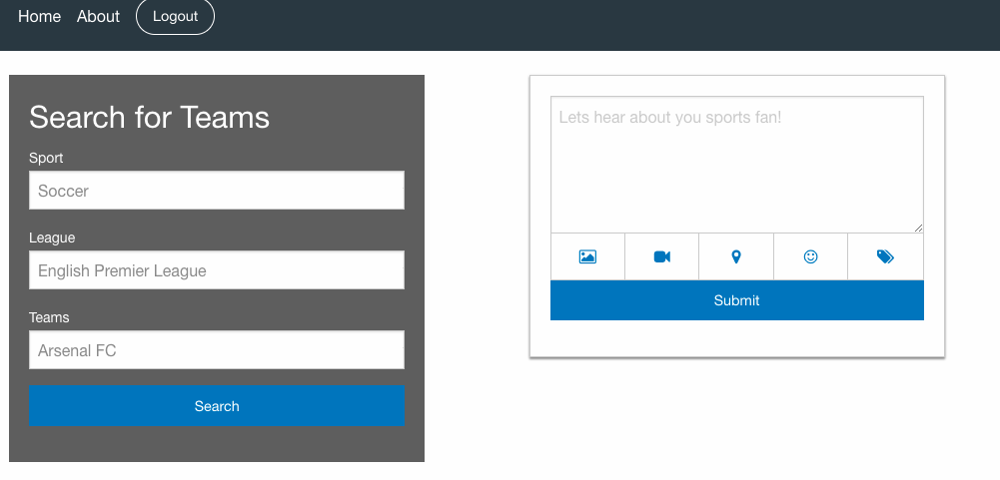

# Just Your Teams

Pitch: 
The modern sports website is too convoluted and numerous. We are aiming to build a clean, preferences focus news resource for sports. The user will be prompted to pick a preference of leagues/teams upon initial log in and will only see news related to results, current matches, upcoming fixtures and press releases. This will make our website a personalized team feed as opposed to requiring a user to syphon through pages upon pages to find the news they are looking for. 

# Goals 

create a site that allows a user to login and track their favorite team from English Premier League to start -> then add La Liga -> then add NBA

User will be able to:
    - create a unique profile
    - see 5 most recent scores
    - see upcoming 5 games for club
        - Recent scores and upcoming games are for all competitions
        - So if a team is in the UEFA Champions League the user will be updated on that score

Site has infra structure to expand to more Sports, Leagues and thusly include more teams

# Technologies

We leveraged our expertise with Foundation to create a truly adpative web app
We utilized MySQL to create a data base of users and their preferences
Sportsradar was the API we elected to use to get score and schedule data
    - The API has a wide variety of services to enable expansion

# Where We Go From here

Include more sports, leagues and teams
Expand user page to allow press releases and league tables/standings
Allow users to communicate with each other or build communities
Save memorable results with a personalized write up
Much, much, more!

# Screen Shots

